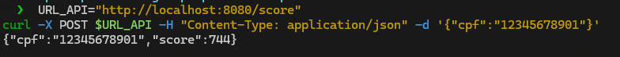
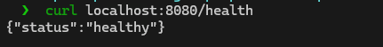
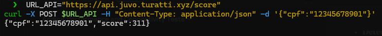
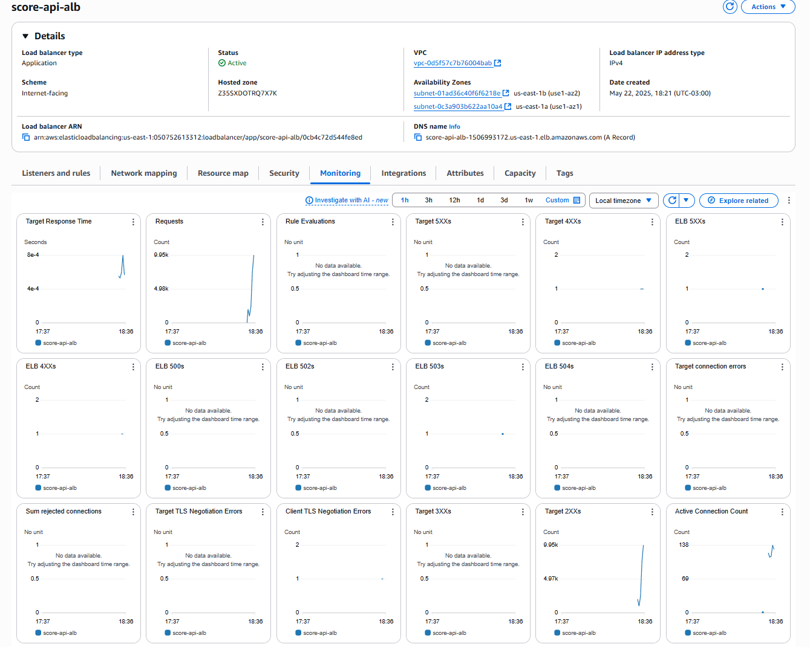
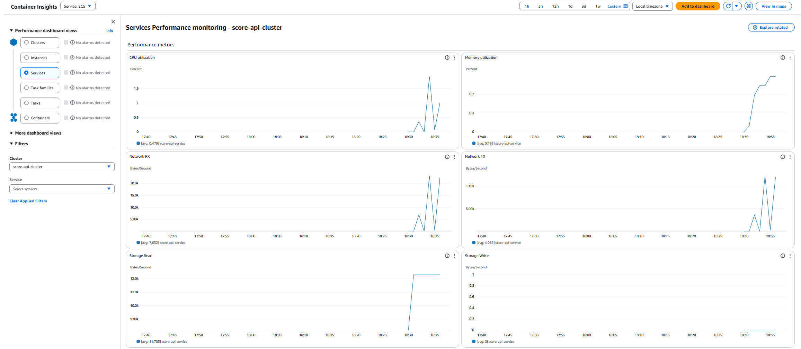

# Decisões Técnicas e Justificativas

## Desenho da Arquitetura
  

A arquitetura proposta para a API de Score de Crédito foi desenhada com foco em alta disponibilidade, escalabilidade e segurança. A seguir, apresento as principais decisões técnicas tomadas durante o desenvolvimento da solução, juntamente com suas justificativas.

Utilizado o [Diagrams as Code](https://diagrams.mingrammer.com/docs/getting-started/examples) para criar o diagrama da arquitetura, que pode ser editado e versionado no repositório.

## Executando ambiente local

```bash
docker-compose up --build
```
A API pode ser acessada em `http://localhost:8080/score` e o Health Check em `http://localhost:8080/health`.

```bash	
URL_API="http://localhost:8080/score"
curl -X POST $URL_API -H "Content-Type: application/json" -d '{"cpf":"12345678901"}'
```



**Health Check**: A API possui um endpoint de health check que retorna o status da aplicação. O retorno esperado é `{"status":"healthy"}`.

```bash
curl localhost:8080/health
```




## 1. Escolha da Linguagem: Go

**Decisão**: 

Optei por utilizar Go (Golang) no desenvolvimento da API, alinhando o desafio à minha jornada de aprendizado atual e ao objetivo de aprofundar meu domínio em tecnologias amplamente utilizadas no mercado, como Docker, Kubernetes e Terraform.  
A escolha do Go se deu por sua eficiência na construção de aplicações performáticas, com alta capacidade de lidar com grandes volumes de requisições e baixa latência — características essenciais para APIs modernas e escaláveis. Além disso, sua simplicidade, tipagem estática, suporte nativo à concorrência (via goroutines) e a geração de binários estáticos tornam o processo de desenvolvimento e deploy mais ágil e confiável, especialmente em ambientes containerizados.

**Justificativa**:

- **Alta Performance**: Go oferece desempenho próximo a linguagens compiladas como C/C++, mas com maior produtividade de desenvolvimento.
- **Baixo Consumo de Recursos**: Aplicações Go têm footprint de memória reduzido, permitindo maior densidade de containers.
- **Concorrência Nativa**: O modelo de goroutines e channels facilita o processamento paralelo eficiente.
- **Binários Estáticos**: Go gera binários independentes sem dependências externas, simplificando o deployment.
- **Tempo de Inicialização Rápido**: Crucial para ambientes serverless e escalabilidade dinâmica.

## 2. Escolha do Amazon ECS (Elastic Container Service)

**Decisão**: Implementei a API usando Amazon ECS com Fargate.

**Justificativa**:

- **Gerenciamento Simplificado**: ECS elimina a necessidade de gerenciar a infraestrutura subjacente, permitindo foco no desenvolvimento da aplicação.
- **Fargate (Serverless)**: Elimina a necessidade de provisionar e gerenciar servidores, com pagamento apenas pelos recursos consumidos.
- **Alta Disponibilidade**: Distribuição automática de containers entre múltiplas zonas de disponibilidade.
- **Integração com Serviços AWS**: Integração nativa com CloudWatch, IAM, ECR e outros serviços AWS.
- **Escalabilidade**: Suporte a auto-scaling baseado em métricas de CPU e memória.
- **Segurança**: Isolamento de tarefas e integração com VPC para controle de rede.
- **Custo-Benefício**: Mais econômico que Kubernetes para aplicações de menor complexidade.


## 3. Arquitetura Multi-AZ

**Decisão**: Implementei a infraestrutura em múltiplas Zonas de Disponibilidade (AZs).

**Justificativa**:

- **Resiliência**: Proteção contra falhas em uma única zona de disponibilidade.
- **Alta Disponibilidade**: Garantia de SLA elevado mesmo durante manutenções ou falhas da AWS.
- **Distribuição de Carga**: Balanceamento geográfico do tráfego para melhor desempenho.

## 4. VPC com Subnets Públicas e Privadas

**Decisão**: Criei uma VPC dedicada com subnets públicas e privadas.

**Justificativa**:

- **Isolamento de Rede**: Separação clara entre recursos expostos à internet e recursos internos.
- **Segurança em Camadas**: ALB em subnets públicas e containers em subnets privadas.
- **Controle de Tráfego**: NAT Gateway permite que containers em subnets privadas acessem a internet, mas não sejam acessíveis diretamente.

## 5. Application Load Balancer (ALB)

**Decisão**: Utilizei um ALB para gerenciar o tráfego para a aplicação.

**Justificativa**:

- **Balanceamento de Carga**: Distribuição eficiente do tráfego entre múltiplas instâncias da aplicação.
- **Health Checks**: Monitoramento contínuo da saúde dos containers e redirecionamento automático do tráfego.
- **SSL/TLS Termination**: Gerenciamento centralizado de certificados SSL/TLS.
- **Path-Based Routing**: Possibilidade de rotear tráfego com base em padrões de URL (útil para futuras expansões).
- **Integração com AWS WAF**: Possibilidade de adicionar proteção contra ataques web.

## 6. Auto Scaling

**Decisão**: Implementei políticas de auto scaling baseadas em CPU e memória.

**Justificativa**:

- **Elasticidade**: Ajuste automático da capacidade conforme a demanda.
- **Otimização de Custos**: Redução de recursos em períodos de baixa demanda.
- **Resiliência a Picos**: Capacidade de lidar com aumentos súbitos de tráfego.
- **Métricas Múltiplas**: Escalabilidade baseada tanto em CPU quanto em memória para cobrir diferentes padrões de carga.

## 7. Amazon ECR (Elastic Container Registry)

**Decisão**: Utilizei o ECR para armazenar e gerenciar imagens de containers.

**Justificativa**:

- **Integração com ECS**: Simplifica o fluxo de deployment de imagens para o ECS.
- **Segurança**: Controle de acesso via IAM e escaneamento automático de vulnerabilidades.
- **Alta Disponibilidade**: Serviço gerenciado com replicação automática.
- **Políticas de Ciclo de Vida**: Gerenciamento automático de versões de imagens para otimizar custos.

## 8. CloudWatch para Monitoramento e Logs

**Decisão**: Implementei monitoramento e logging centralizados com CloudWatch.

**Justificativa**:

- **Visibilidade Centralizada**: Coleta de logs e métricas em um único local.
- **Alertas**: Possibilidade de configurar alarmes baseados em métricas.
- **Retenção Configurável**: Definição de políticas de retenção de logs conforme necessidades de compliance.
- **Insights em Tempo Real**: Monitoramento em tempo real do desempenho da aplicação.

## 9. HTTPS com ACM (AWS Certificate Manager)

**Decisão**: Implementei HTTPS utilizando certificados gerenciados pelo ACM.

**Justificativa**:

- **Segurança**: Criptografia do tráfego entre clientes e a API.
- **Confiança**: Certificados confiáveis reconhecidos pelos navegadores.
- **Renovação Automática**: Gerenciamento automático do ciclo de vida dos certificados.
- **Integração com Route53**: Validação automática de domínio.

## 10. IAM Roles com Princípio de Privilégio Mínimo

**Decisão**: Criei roles IAM específicos para cada componente do sistema.

**Justificativa**:

- **Segurança**: Aplicação do princípio de privilégio mínimo.
- **Auditoria**: Facilidade para auditar permissões e identificar potenciais riscos.
- **Isolamento**: Separação clara de responsabilidades entre componentes.

## Benefícios da Arquitetura Proposta

- **Alta Disponibilidade**: Arquitetura multi-AZ com auto scaling garante disponibilidade mesmo durante falhas parciais.
- **Escalabilidade**: Capacidade de escalar horizontalmente para lidar com picos de demanda.
- **Segurança em Camadas**: Múltiplas camadas de segurança, desde a rede até o nível de aplicação.
- **Custo Otimizado**: Uso de serviços serverless e auto scaling para pagar apenas pelos recursos utilizados.
- **Operação Simplificada**: Uso de serviços gerenciados reduz a carga operacional.
- **Observabilidade**: Monitoramento e logging abrangentes para rápida detecção e resolução de problemas.
- **CI/CD Ready**: Arquitetura preparada para integração com pipelines de CI/CD.
- **Infraestrutura como Código**: Uso de Terraform para versionamento e automação da infraestrutura.
- **Facilidade de Manutenção**: Separação clara entre componentes facilita atualizações e manutenções.
- **Flexibilidade**: Possibilidade de adicionar novos serviços ou componentes sem grandes reestruturações.

## 11. Executando o teste

```bash
URL_API="https://api.juvo.turatti.xyz/score"
curl -X POST $URL_API -H "Content-Type: application/json" -d '{"cpf":"12345678901"}'
```
**Resultado**:
```json
{"cpf":"12345678901","score":311}
```



## 12. Execução do stress test

```bash
python3 stress_test/stress.py
```

O stress test foi executado com sucesso, validando a capacidade da API de lidar com picos de carga. O teste envolveu o envio de requisições simultâneas para verificar a resiliência e a performance da aplicação sob condições adversas.

**Resultados do Stress Test**:
- **Total de Requisições**: 1000
- **Requisições por Segundo**: 100
```txt
python3 stress.py | grep score
200: {"cpf":"33577238674","score":834}
200: {"cpf":"88715049680","score":401}
200: {"cpf":"85513815206","score":384}
200: {"cpf":"12835877428","score":326}
200: {"cpf":"88399387614","score":707}
200: {"cpf":"54257736844","score":463}
200: {"cpf":"26935260787","score":694}
200: {"cpf":"63523599571","score":722}
200: {"cpf":"50188254218","score":302}
200: {"cpf":"02335134930","score":525}
200: {"cpf":"43788392290","score":371}
200: {"cpf":"19602073853","score":777}
200: {"cpf":"97636712210","score":624}
200: {"cpf":"81101264640","score":532}
200: {"cpf":"89011325320","score":604}
200: {"cpf":"11339409860","score":682}
200: {"cpf":"05521563377","score":685}
200: {"cpf":"89528014828","score":582}
200: {"cpf":"71375401807","score":531}
200: {"cpf":"47952256807","score":419}
200: {"cpf":"27810201506","score":424}
200: {"cpf":"35252730296","score":603}
200: {"cpf":"43677670942","score":536}
200: {"cpf":"78875948127","score":806}
200: {"cpf":"66023195318","score":618}
200: {"cpf":"29185204706","score":635}
200: {"cpf":"00547753888","score":633}
200: {"cpf":"82740811454","score":716}
200: {"cpf":"76582192230","score":393}
200: {"cpf":"76070156129","score":518}
200: {"cpf":"42330116292","score":315}
200: {"cpf":"52894612214","score":352}
200: {"cpf":"11784020028","score":778}
200: {"cpf":"06618789028","score":401}
200: {"cpf":"92246594030","score":754}
200: {"cpf":"30746053835","score":575}
200: {"cpf":"78214733243","score":638}
200: {"cpf":"19308196765","score":692}
200: {"cpf":"97589073792","score":537}
200: {"cpf":"88973939262","score":545}
200: {"cpf":"02469652235","score":787}
200: {"cpf":"19953298190","score":398}
200: {"cpf":"76316701535","score":655}
200: {"cpf":"46064719214","score":608}
200: {"cpf":"52829635582","score":420}
200: {"cpf":"60919386490","score":656}
200: {"cpf":"52773517873","score":349}
200: {"cpf":"66729865105","score":833}
200: {"cpf":"00296005452","score":668}
200: {"cpf":"72595858890","score":364}
200: {"cpf":"57332603357","score":794}
200: {"cpf":"39208062473","score":576}
200: {"cpf":"32724915038","score":322}
200: {"cpf":"99512350696","score":470}
200: {"cpf":"27458471042","score":304}
200: {"cpf":"24823028627","score":556}
200: {"cpf":"48616244441","score":307}
200: {"cpf":"07142845481","score":461}
200: {"cpf":"20732805953","score":725}
200: {"cpf":"21403205817","score":838}
200: {"cpf":"25765255809","score":712}
200: {"cpf":"96550486408","score":800}
200: {"cpf":"86640253712","score":458}
200: {"cpf":"57159799607","score":566}
200: {"cpf":"24374577394","score":598}
200: {"cpf":"03292730864","score":783}
200: {"cpf":"27653317073","score":434}
200: {"cpf":"25116868990","score":333}
200: {"cpf":"09585005093","score":712}
200: {"cpf":"48891661813","score":457}
200: {"cpf":"31382025785","score":301}
200: {"cpf":"35895299709","score":402}
200: {"cpf":"46998730578","score":785}
200: {"cpf":"28038061004","score":519}
200: {"cpf":"22035685931","score":683}
200: {"cpf":"98731502857","score":751}
200: {"cpf":"47938156930","score":797}
200: {"cpf":"52353565190","score":439}
200: {"cpf":"43944568354","score":807}
200: {"cpf":"69204741406","score":409}
200: {"cpf":"31293212091","score":482}
200: {"cpf":"82721044745","score":716}
200: {"cpf":"73495453717","score":624}
200: {"cpf":"27726792418","score":722}
200: {"cpf":"42582101109","score":422}
200: {"cpf":"41606939386","score":706}
200: {"cpf":"97484672017","score":475}
200: {"cpf":"41365885429","score":523}
200: {"cpf":"41079390812","score":771}
200: {"cpf":"62586620305","score":817}
200: {"cpf":"70808215760","score":715}
200: {"cpf":"14856642090","score":763}
200: {"cpf":"12590054106","score":314}
200: {"cpf":"11283654059","score":431}
200: {"cpf":"67447551376","score":551}
200: {"cpf":"10038247909","score":766}
200: {"cpf":"02244189716","score":587}
200: {"cpf":"13434149970","score":358}
200: {"cpf":"26328607768","score":518}
200: {"cpf":"28867963368","score":746}
200: {"cpf":"89719333308","score":702}
200: {"cpf":"25775484355","score":565}
200: {"cpf":"40526262060","score":841}
200: {"cpf":"20029420482","score":788}
200: {"cpf":"90424601648","score":372}
200: {"cpf":"68876497803","score":623}
200: {"cpf":"65830775239","score":778}
200: {"cpf":"77328886420","score":686}
200: {"cpf":"68913236222","score":370}
200: {"cpf":"69711269988","score":824}
200: {"cpf":"64316236814","score":663}
200: {"cpf":"44232085637","score":711}
200: {"cpf":"32070547906","score":846}
200: {"cpf":"42840603411","score":621}
200: {"cpf":"94330244438","score":338}
200: {"cpf":"91408177099","score":344}
200: {"cpf":"94950972073","score":531}
200: {"cpf":"32100989308","score":437}
200: {"cpf":"40830117938","score":526}
200: {"cpf":"44917583527","score":591}
200: {"cpf":"70127048960","score":561}
200: {"cpf":"28492897953","score":463}
200: {"cpf":"19563040457","score":757}
200: {"cpf":"10790164817","score":694}
200: {"cpf":"83625396076","score":801}
200: {"cpf":"63378756802","score":346}
200: {"cpf":"00344423166","score":660}
200: {"cpf":"99167523030","score":329}
200: {"cpf":"55260716000","score":600}
200: {"cpf":"98374539151","score":608}
200: {"cpf":"18772173106","score":718}
200: {"cpf":"06058323827","score":564}
200: {"cpf":"53567655680","score":572}
200: {"cpf":"43600371479","score":437}
200: {"cpf":"89379229240","score":819}
200: {"cpf":"17019723799","score":731}
200: {"cpf":"63088636103","score":603}
200: {"cpf":"59613691375","score":559}
200: {"cpf":"22436495190","score":511}
200: {"cpf":"43666524044","score":543}
200: {"cpf":"97721104408","score":573}
200: {"cpf":"55822560830","score":627}
200: {"cpf":"63749069506","score":766}
200: {"cpf":"04436595242","score":706}
200: {"cpf":"05198656003","score":408}
200: {"cpf":"51570478864","score":814}
200: {"cpf":"55703010624","score":518}
200: {"cpf":"57089510603","score":810}
200: {"cpf":"90494686081","score":750}
200: {"cpf":"88521957696","score":451}
200: {"cpf":"36537635179","score":383}
200: {"cpf":"78137109080","score":554}
200: {"cpf":"96586590558","score":347}
200: {"cpf":"13877429734","score":408}
200: {"cpf":"06256220064","score":646}
200: {"cpf":"70685223604","score":596}
200: {"cpf":"11578816530","score":832}
200: {"cpf":"60062018280","score":646}
200: {"cpf":"28300303626","score":686}
200: {"cpf":"66755974935","score":547}
200: {"cpf":"92084943817","score":427}
200: {"cpf":"91699049289","score":517}
200: {"cpf":"86466570517","score":691}
200: {"cpf":"28480196700","score":473}
200: {"cpf":"19746426745","score":329}
200: {"cpf":"24757768974","score":520}
200: {"cpf":"78222203142","score":620}
200: {"cpf":"98784048115","score":354}
200: {"cpf":"86346368109","score":486}
200: {"cpf":"66757346877","score":519}
200: {"cpf":"37358089561","score":410}
200: {"cpf":"05311520906","score":387}
200: {"cpf":"39976548915","score":839}
200: {"cpf":"35206744409","score":300}
200: {"cpf":"98773237701","score":742}
200: {"cpf":"63587084491","score":788}
200: {"cpf":"89283302117","score":785}
200: {"cpf":"90482899808","score":371}
200: {"cpf":"20848589688","score":471}
200: {"cpf":"26813325833","score":619}
200: {"cpf":"62945755246","score":496}
200: {"cpf":"57056757472","score":430}
200: {"cpf":"16684631216","score":738}
200: {"cpf":"10668454504","score":447}
200: {"cpf":"47418918283","score":520}
200: {"cpf":"24087120686","score":500}
200: {"cpf":"89737677552","score":428}
200: {"cpf":"45317712653","score":821}
200: {"cpf":"75843554473","score":653}
200: {"cpf":"37516832839","score":413}
200: {"cpf":"89660434022","score":400}
200: {"cpf":"51831733030","score":759}
200: {"cpf":"47922374402","score":315}
200: {"cpf":"07130072300","score":536}
200: {"cpf":"83694641300","score":399}
200: {"cpf":"72639503758","score":411}
200: {"cpf":"03530163732","score":444}
200: {"cpf":"32955206660","score":780}
200: {"cpf":"88505393473","score":717}
200: {"cpf":"74252673496","score":573}
200: {"cpf":"43055403550","score":761}
200: {"cpf":"04554877582","score":768}
200: {"cpf":"78632034227","score":681}
200: {"cpf":"92016584866","score":606}
200: {"cpf":"11735721980","score":531}
200: {"cpf":"30982799667","score":327}
200: {"cpf":"61549835149","score":800}
200: {"cpf":"52536539881","score":367}
200: {"cpf":"89378812333","score":717}
200: {"cpf":"46565286337","score":806}
200: {"cpf":"48715411184","score":369}
200: {"cpf":"27803418406","score":449}
200: {"cpf":"96572872513","score":785}
200: {"cpf":"37759969660","score":579}
200: {"cpf":"19565020763","score":390}
200: {"cpf":"17624119030","score":648}
200: {"cpf":"64248368889","score":405}
200: {"cpf":"58082110775","score":718}
200: {"cpf":"29311437310","score":699}
200: {"cpf":"02254841882","score":559}
200: {"cpf":"97923548404","score":486}
200: {"cpf":"95016687382","score":310}
200: {"cpf":"19371367520","score":692}
200: {"cpf":"42101237733","score":769}
200: {"cpf":"20611992329","score":834}
200: {"cpf":"09428080705","score":527}
200: {"cpf":"64708977891","score":743}
200: {"cpf":"29802118850","score":710}
200: {"cpf":"88824588492","score":763}
200: {"cpf":"12357938501","score":647}
200: {"cpf":"36232790804","score":788}
200: {"cpf":"66848034320","score":555}
200: {"cpf":"86398243048","score":727}
200: {"cpf":"41741088380","score":805}
200: {"cpf":"52772095142","score":671}
200: {"cpf":"86568657492","score":553}
200: {"cpf":"49307011478","score":687}
200: {"cpf":"94955293522","score":608}
200: {"cpf":"20280108001","score":657}
200: {"cpf":"64524958606","score":380}
200: {"cpf":"77670958430","score":631}
200: {"cpf":"68146781527","score":391}
200: {"cpf":"34371730655","score":674}
200: {"cpf":"73744623017","score":807}
200: {"cpf":"77725201580","score":501}
200: {"cpf":"01742957404","score":696}
200: {"cpf":"20150663226","score":360}
200: {"cpf":"69147132515","score":801}
200: {"cpf":"90994815190","score":704}
200: {"cpf":"61818528754","score":698}
200: {"cpf":"44566821676","score":508}
200: {"cpf":"19666031779","score":537}
200: {"cpf":"57831875000","score":782}
200: {"cpf":"21309916020","score":415}
200: {"cpf":"96071984688","score":702}
200: {"cpf":"95717101724","score":427}
200: {"cpf":"71586708139","score":758}
200: {"cpf":"20712122745","score":500}
200: {"cpf":"71578825318","score":613}
200: {"cpf":"52710436736","score":694}
200: {"cpf":"55295355349","score":761}
200: {"cpf":"06957642844","score":343}
200: {"cpf":"29726876559","score":613}
200: {"cpf":"50431335540","score":684}
200: {"cpf":"40577417550","score":816}
200: {"cpf":"57319685787","score":572}
200: {"cpf":"87945501311","score":393}
200: {"cpf":"87249009907","score":502}
200: {"cpf":"74684688852","score":679}
200: {"cpf":"71950403211","score":471}
200: {"cpf":"01828098388","score":559}
200: {"cpf":"03831676801","score":468}
200: {"cpf":"94896549228","score":499}
200: {"cpf":"74864053855","score":499}
200: {"cpf":"54563644250","score":330}
200: {"cpf":"52361799553","score":840}
200: {"cpf":"62111435910","score":453}
200: {"cpf":"98965515530","score":519}
200: {"cpf":"86217617935","score":409}
200: {"cpf":"81804372480","score":336}
200: {"cpf":"65634344280","score":303}
200: {"cpf":"41449407056","score":745}
200: {"cpf":"43897985888","score":439}
200: {"cpf":"00931634288","score":326}
200: {"cpf":"19291370010","score":680}
200: {"cpf":"15378526809","score":684}
200: {"cpf":"95924216411","score":356}
200: {"cpf":"29659598157","score":540}
200: {"cpf":"61701743582","score":705}
200: {"cpf":"74048726420","score":719}
200: {"cpf":"21561972533","score":313}
200: {"cpf":"89824812148","score":647}
200: {"cpf":"27436075802","score":698}
200: {"cpf":"69230717207","score":725}
200: {"cpf":"06775733755","score":479}
200: {"cpf":"28313897805","score":688}
200: {"cpf":"32756989908","score":470}
200: {"cpf":"81372041214","score":657}
200: {"cpf":"07181101455","score":573}
200: {"cpf":"97518770830","score":403}
200: {"cpf":"28970865560","score":580}
200: {"cpf":"34627815964","score":389}
200: {"cpf":"22978524790","score":489}
200: {"cpf":"97653066100","score":578}
200: {"cpf":"66149715906","score":550}
200: {"cpf":"99251438293","score":337}
200: {"cpf":"79834814038","score":330}
200: {"cpf":"68159714300","score":363}
200: {"cpf":"91139447114","score":592}
200: {"cpf":"90486836533","score":824}
200: {"cpf":"85436574661","score":421}
200: {"cpf":"83934358462","score":389}
200: {"cpf":"76806031110","score":575}
200: {"cpf":"97288129730","score":819}
200: {"cpf":"56425998288","score":792}
200: {"cpf":"21646351401","score":535}
200: {"cpf":"46288517356","score":817}
200: {"cpf":"45321839107","score":498}
200: {"cpf":"39335401862","score":316}
200: {"cpf":"41770582975","score":775}
200: {"cpf":"61262986168","score":781}
200: {"cpf":"87123870450","score":691}
200: {"cpf":"23368947699","score":659}
200: {"cpf":"06352655599","score":423}
200: {"cpf":"84162989710","score":750}
200: {"cpf":"88418557036","score":444}
200: {"cpf":"35537989042","score":565}
200: {"cpf":"96166571860","score":624}
200: {"cpf":"46766675403","score":745}
200: {"cpf":"13623972886","score":720}
200: {"cpf":"62909451577","score":374}
200: {"cpf":"82218959038","score":609}
200: {"cpf":"62588609317","score":458}
200: {"cpf":"26492646754","score":378}
200: {"cpf":"75525189445","score":771}
200: {"cpf":"11656019230","score":657}
200: {"cpf":"92325250032","score":725}
200: {"cpf":"85082078755","score":374}
200: {"cpf":"66554599908","score":571}
200: {"cpf":"13486524704","score":468}
200: {"cpf":"68595530815","score":812}
200: {"cpf":"81053423160","score":679}
200: {"cpf":"13470220239","score":510}
200: {"cpf":"66410773226","score":419}
200: {"cpf":"55700325926","score":820}
200: {"cpf":"88478613145","score":342}
200: {"cpf":"70209805382","score":825}
200: {"cpf":"94569993516","score":359}
200: {"cpf":"22918653233","score":576}
200: {"cpf":"79694739624","score":846}
200: {"cpf":"26904241691","score":406}
200: {"cpf":"75864407780","score":306}
200: {"cpf":"22995123227","score":607}
200: {"cpf":"38983215500","score":838}
200: {"cpf":"05901513398","score":817}
200: {"cpf":"91498464696","score":552}
200: {"cpf":"39814250066","score":798}
200: {"cpf":"57292254403","score":489}
200: {"cpf":"36229103990","score":334}
200: {"cpf":"63047876347","score":814}
200: {"cpf":"26807554648","score":803}
200: {"cpf":"86076000104","score":519}
200: {"cpf":"47213146637","score":410}
200: {"cpf":"37739312983","score":769}
200: {"cpf":"53770617487","score":398}
200: {"cpf":"35842270544","score":423}
200: {"cpf":"72568364734","score":717}
200: {"cpf":"90643992120","score":441}
200: {"cpf":"22061114547","score":538}
200: {"cpf":"84476505457","score":729}
200: {"cpf":"69154513235","score":669}
200: {"cpf":"76058052920","score":436}
200: {"cpf":"65272843304","score":757}
200: {"cpf":"15038180981","score":535}
200: {"cpf":"18028307230","score":803}
200: {"cpf":"78591377982","score":839}
200: {"cpf":"77125973086","score":334}
200: {"cpf":"04824884764","score":578}
200: {"cpf":"78294526878","score":352}
200: {"cpf":"91163422401","score":835}
200: {"cpf":"59383582804","score":738}
200: {"cpf":"24334307809","score":735}
200: {"cpf":"42038902178","score":596}
200: {"cpf":"03424068926","score":736}
200: {"cpf":"15874177230","score":488}
200: {"cpf":"04914609100","score":527}
200: {"cpf":"49400896220","score":551}
200: {"cpf":"59461729804","score":754}
200: {"cpf":"81262844398","score":473}
200: {"cpf":"32124913611","score":661}
200: {"cpf":"96270346304","score":370}
200: {"cpf":"51647707170","score":340}
200: {"cpf":"03326496877","score":638}
200: {"cpf":"47796265360","score":818}
200: {"cpf":"96508403974","score":592}
200: {"cpf":"54359866720","score":364}
200: {"cpf":"48550600113","score":804}
200: {"cpf":"39337990237","score":748}
200: {"cpf":"90801365228","score":315}
200: {"cpf":"52598177100","score":630}
200: {"cpf":"33881411771","score":555}
200: {"cpf":"72442471760","score":707}
200: {"cpf":"89433953703","score":631}
200: {"cpf":"53112046722","score":786}
200: {"cpf":"87621016256","score":750}
200: {"cpf":"17845008877","score":718}
200: {"cpf":"89294957888","score":436}
200: {"cpf":"79098198708","score":563}
200: {"cpf":"60619395745","score":658}
200: {"cpf":"13801698874","score":406}
200: {"cpf":"19451240756","score":772}
200: {"cpf":"43507533898","score":662}
200: {"cpf":"18732976534","score":488}
200: {"cpf":"86488036084","score":819}
200: {"cpf":"11066561133","score":502}
200: {"cpf":"17447574457","score":385}
200: {"cpf":"35771326801","score":710}
200: {"cpf":"38650982409","score":312}
200: {"cpf":"15651378685","score":340}
200: {"cpf":"90438175468","score":761}
200: {"cpf":"92267454718","score":518}
200: {"cpf":"95654499564","score":421}
200: {"cpf":"52021695905","score":431}
200: {"cpf":"78151911930","score":572}
200: {"cpf":"95029012150","score":545}
200: {"cpf":"49666988470","score":635}
200: {"cpf":"83172212459","score":432}
200: {"cpf":"08093321080","score":349}
200: {"cpf":"27292090184","score":692}
200: {"cpf":"53572799503","score":313}
200: {"cpf":"45753292232","score":688}
200: {"cpf":"16728208208","score":664}
200: {"cpf":"48080710023","score":585}
200: {"cpf":"12356977708","score":756}
200: {"cpf":"05009015463","score":723}
200: {"cpf":"74674641772","score":408}
200: {"cpf":"09787860415","score":813}
200: {"cpf":"43606263120","score":562}
200: {"cpf":"23721881605","score":678}
200: {"cpf":"12446267246","score":724}
200: {"cpf":"56046641624","score":326}
200: {"cpf":"79874646861","score":833}
200: {"cpf":"28108724066","score":617}
200: {"cpf":"03787257187","score":709}
200: {"cpf":"54532334780","score":680}
200: {"cpf":"45646334659","score":672}
200: {"cpf":"07224831395","score":788}
200: {"cpf":"66803480305","score":781}
200: {"cpf":"85613587264","score":813}
200: {"cpf":"86038097040","score":444}
200: {"cpf":"82132019223","score":655}
200: {"cpf":"47610112208","score":522}
200: {"cpf":"82202815295","score":773}
200: {"cpf":"53330626925","score":474}
200: {"cpf":"03233324987","score":621}
200: {"cpf":"01816253502","score":840}
200: {"cpf":"22809241457","score":491}
200: {"cpf":"55860907320","score":614}
200: {"cpf":"62001866690","score":672}
200: {"cpf":"89276870008","score":352}
200: {"cpf":"42588063900","score":534}
200: {"cpf":"75108127634","score":571}
200: {"cpf":"16510712920","score":512}
200: {"cpf":"46182690810","score":479}
200: {"cpf":"93824364808","score":515}
200: {"cpf":"18243411992","score":456}
200: {"cpf":"11951300904","score":305}
200: {"cpf":"21615634916","score":607}
200: {"cpf":"54850817386","score":557}
200: {"cpf":"45592377355","score":788}
200: {"cpf":"02625772751","score":330}
200: {"cpf":"72095714695","score":778}
200: {"cpf":"65370513554","score":483}
200: {"cpf":"25320386168","score":658}
200: {"cpf":"07455483856","score":343}
200: {"cpf":"17938817317","score":687}
200: {"cpf":"91350429155","score":590}
200: {"cpf":"41686456220","score":441}
200: {"cpf":"13027712640","score":502}
200: {"cpf":"31192423909","score":664}
200: {"cpf":"83699780708","score":431}
200: {"cpf":"78287409721","score":396}
200: {"cpf":"22654278700","score":667}
200: {"cpf":"66083146550","score":592}
200: {"cpf":"45430538779","score":600}
200: {"cpf":"61130705650","score":464}
200: {"cpf":"56646452539","score":312}
200: {"cpf":"73527610120","score":526}
200: {"cpf":"09925493374","score":330}
200: {"cpf":"65661835582","score":738}
200: {"cpf":"26442677907","score":512}
200: {"cpf":"64807835491","score":410}
200: {"cpf":"03589822600","score":800}
200: {"cpf":"62198618842","score":340}
200: {"cpf":"28316756692","score":490}
200: {"cpf":"56504602808","score":424}
200: {"cpf":"59315783239","score":642}
200: {"cpf":"91575926679","score":479}
200: {"cpf":"62744245208","score":557}
200: {"cpf":"01772828513","score":813}
200: {"cpf":"28688529396","score":448}
200: {"cpf":"59353776163","score":685}
200: {"cpf":"66638127349","score":790}
200: {"cpf":"82505061629","score":779}
200: {"cpf":"71341182231","score":429}
200: {"cpf":"94285661284","score":561}
200: {"cpf":"15402018219","score":508}
200: {"cpf":"60414196643","score":707}
200: {"cpf":"52102397564","score":794}
200: {"cpf":"47868268557","score":831}
200: {"cpf":"12480013979","score":676}
200: {"cpf":"53950873465","score":848}
200: {"cpf":"08497583353","score":797}
200: {"cpf":"75815140996","score":748}
200: {"cpf":"72395369551","score":620}
200: {"cpf":"15126574922","score":568}
200: {"cpf":"92566090378","score":363}
200: {"cpf":"44202496760","score":677}
200: {"cpf":"07383761758","score":375}
200: {"cpf":"10294340505","score":692}
200: {"cpf":"43248279907","score":574}
200: {"cpf":"87344248816","score":795}
200: {"cpf":"67347390311","score":785}
200: {"cpf":"50456998225","score":319}
200: {"cpf":"71600980139","score":506}
200: {"cpf":"61934479705","score":619}
200: {"cpf":"86993647338","score":798}
200: {"cpf":"76844702809","score":542}
200: {"cpf":"19784314495","score":573}
200: {"cpf":"27852110061","score":709}
200: {"cpf":"83138325840","score":725}
200: {"cpf":"77343241699","score":410}
200: {"cpf":"39559175505","score":363}
200: {"cpf":"45521558730","score":389}
200: {"cpf":"45594587829","score":424}
200: {"cpf":"10988059843","score":704}
200: {"cpf":"73378844353","score":553}
200: {"cpf":"49861857800","score":539}
200: {"cpf":"94372430345","score":476}
200: {"cpf":"22274467145","score":784}
200: {"cpf":"12184425907","score":450}
200: {"cpf":"20020805420","score":567}
200: {"cpf":"73670781005","score":807}
200: {"cpf":"92639953036","score":766}
200: {"cpf":"10319097706","score":624}
200: {"cpf":"02408552052","score":405}
200: {"cpf":"66990273526","score":452}
200: {"cpf":"63137657881","score":499}
200: {"cpf":"57518218828","score":555}
200: {"cpf":"06749472311","score":449}
200: {"cpf":"43760591612","score":405}
200: {"cpf":"37364654917","score":407}
200: {"cpf":"06723458389","score":618}
200: {"cpf":"34773449365","score":434}
200: {"cpf":"90599736585","score":694}
200: {"cpf":"51031251294","score":615}
200: {"cpf":"30993791310","score":479}
200: {"cpf":"64357485940","score":501}
200: {"cpf":"54985221937","score":492}
200: {"cpf":"09833790178","score":459}
200: {"cpf":"72669700756","score":784}
200: {"cpf":"47101688900","score":510}
200: {"cpf":"12402109149","score":340}
200: {"cpf":"05919509015","score":814}
200: {"cpf":"95409849043","score":661}
200: {"cpf":"91702272176","score":607}
200: {"cpf":"06847638508","score":590}
200: {"cpf":"71057947040","score":715}
200: {"cpf":"57181072706","score":385}
200: {"cpf":"56816883721","score":370}
200: {"cpf":"41676666001","score":595}
200: {"cpf":"02418771644","score":811}
200: {"cpf":"31634632583","score":593}
200: {"cpf":"02152544226","score":665}
200: {"cpf":"13073627294","score":502}
200: {"cpf":"40964619202","score":496}
200: {"cpf":"98876718192","score":584}
200: {"cpf":"28398828170","score":368}
200: {"cpf":"40546848583","score":803}
200: {"cpf":"25535354228","score":693}
200: {"cpf":"56493728967","score":640}
200: {"cpf":"88806382110","score":347}
200: {"cpf":"61486554628","score":821}
200: {"cpf":"25790703542","score":439}
200: {"cpf":"12507578009","score":597}
200: {"cpf":"32294027310","score":774}
200: {"cpf":"97360383609","score":351}
200: {"cpf":"21097995011","score":395}
200: {"cpf":"36084990401","score":422}
200: {"cpf":"56578891340","score":561}
200: {"cpf":"06965108479","score":300}
200: {"cpf":"49005527552","score":637}
200: {"cpf":"49827598716","score":720}
200: {"cpf":"31682433374","score":475}
200: {"cpf":"89947986330","score":817}
200: {"cpf":"32913147860","score":482}
200: {"cpf":"28331485009","score":332}
200: {"cpf":"17106263648","score":819}
200: {"cpf":"96002855602","score":720}
200: {"cpf":"74339323055","score":526}
200: {"cpf":"20605896496","score":796}
200: {"cpf":"99609362524","score":701}
200: {"cpf":"18717605180","score":643}
200: {"cpf":"40197414508","score":819}
200: {"cpf":"45193202403","score":628}
200: {"cpf":"66647205829","score":746}
200: {"cpf":"34537605499","score":441}
200: {"cpf":"93616925347","score":469}
200: {"cpf":"72591906718","score":742}
200: {"cpf":"92509910450","score":481}
200: {"cpf":"37189532773","score":547}
200: {"cpf":"39947801365","score":637}
200: {"cpf":"75478039896","score":494}
200: {"cpf":"67017115457","score":390}
200: {"cpf":"90168267268","score":563}
200: {"cpf":"64766488024","score":323}
200: {"cpf":"20597616116","score":452}
200: {"cpf":"30210218320","score":322}
200: {"cpf":"38934067861","score":613}
200: {"cpf":"53780144506","score":478}
200: {"cpf":"85326007274","score":684}
200: {"cpf":"57741492349","score":592}
200: {"cpf":"89868883512","score":391}
200: {"cpf":"28957421203","score":397}
200: {"cpf":"17324084168","score":613}
200: {"cpf":"71432688790","score":668}
200: {"cpf":"44223567713","score":532}
200: {"cpf":"35098910749","score":446}
200: {"cpf":"07735113188","score":345}
200: {"cpf":"67307795191","score":838}
200: {"cpf":"05149996670","score":437}
200: {"cpf":"91005127530","score":517}
200: {"cpf":"68751379171","score":538}
200: {"cpf":"73355615587","score":332}
200: {"cpf":"24045693254","score":357}
200: {"cpf":"81832137406","score":567}
200: {"cpf":"66764759600","score":470}
200: {"cpf":"50138215685","score":758}
200: {"cpf":"11217427341","score":380}
200: {"cpf":"64087662500","score":489}
200: {"cpf":"71599888769","score":578}
200: {"cpf":"60873508610","score":724}
200: {"cpf":"00267312741","score":446}
200: {"cpf":"01080762370","score":700}
200: {"cpf":"25431577867","score":738}
200: {"cpf":"38587836765","score":546}
200: {"cpf":"34494630985","score":455}
200: {"cpf":"83205160720","score":589}
200: {"cpf":"45467277200","score":786}
200: {"cpf":"45844741501","score":416}
200: {"cpf":"84989774604","score":798}
200: {"cpf":"97609865230","score":370}
200: {"cpf":"95284657900","score":578}
200: {"cpf":"64312476390","score":508}
200: {"cpf":"20254739318","score":538}
200: {"cpf":"39408697758","score":543}
200: {"cpf":"18904222400","score":324}
200: {"cpf":"97525190321","score":436}
200: {"cpf":"01496726081","score":466}
200: {"cpf":"73493557507","score":702}
200: {"cpf":"16659779140","score":647}
200: {"cpf":"75604774960","score":788}
200: {"cpf":"54835145305","score":352}
200: {"cpf":"55767532591","score":460}
200: {"cpf":"46661193964","score":371}
200: {"cpf":"26113108074","score":767}
200: {"cpf":"53036372121","score":400}
200: {"cpf":"91274861330","score":711}
200: {"cpf":"18861986323","score":498}
200: {"cpf":"47167654663","score":688}
200: {"cpf":"43599592306","score":395}
200: {"cpf":"23002841897","score":439}
200: {"cpf":"49320942218","score":384}
200: {"cpf":"09766101248","score":620}
200: {"cpf":"78186869670","score":361}
200: {"cpf":"22494202540","score":698}
200: {"cpf":"73994455405","score":645}
200: {"cpf":"42350950050","score":610}
200: {"cpf":"43310859290","score":747}
200: {"cpf":"98552144638","score":849}
200: {"cpf":"54080633050","score":623}
200: {"cpf":"43147860353","score":678}
200: {"cpf":"97346110110","score":359}
200: {"cpf":"29052228400","score":572}
200: {"cpf":"00956023720","score":569}
200: {"cpf":"77504017094","score":318}
200: {"cpf":"58374360909","score":486}
200: {"cpf":"93076831909","score":610}
200: {"cpf":"61882972066","score":609}
200: {"cpf":"26284370318","score":544}
200: {"cpf":"93755046113","score":786}
200: {"cpf":"62012379842","score":357}
200: {"cpf":"11985756978","score":453}
200: {"cpf":"12248905157","score":386}
200: {"cpf":"94491152063","score":820}
200: {"cpf":"96054236857","score":651}
200: {"cpf":"39384069841","score":678}
200: {"cpf":"67996927308","score":787}
200: {"cpf":"28897369626","score":306}
200: {"cpf":"02669397328","score":300}
200: {"cpf":"05187605020","score":813}
200: {"cpf":"47512929862","score":516}
200: {"cpf":"48535150200","score":695}
200: {"cpf":"62228852848","score":814}
200: {"cpf":"69361489305","score":549}
200: {"cpf":"75412741436","score":342}
200: {"cpf":"35492199978","score":430}
200: {"cpf":"14301634886","score":836}
200: {"cpf":"77586128650","score":405}
200: {"cpf":"84439719082","score":561}
200: {"cpf":"14206726302","score":731}
200: {"cpf":"61318216745","score":793}
200: {"cpf":"18779248900","score":726}
200: {"cpf":"92916749071","score":339}
200: {"cpf":"28307572207","score":780}
200: {"cpf":"33573812570","score":348}
200: {"cpf":"99395397977","score":432}
200: {"cpf":"16446192967","score":497}
200: {"cpf":"08176367818","score":485}
200: {"cpf":"97123154363","score":438}
200: {"cpf":"17201890050","score":708}
200: {"cpf":"16340399207","score":749}
200: {"cpf":"11811337422","score":494}
200: {"cpf":"77873211487","score":737}
200: {"cpf":"25229851082","score":309}
200: {"cpf":"66705698403","score":752}
200: {"cpf":"70183707362","score":602}
200: {"cpf":"22311502042","score":841}
200: {"cpf":"99901934958","score":567}
200: {"cpf":"85737279855","score":724}
200: {"cpf":"89451617671","score":757}
200: {"cpf":"26570051440","score":413}
200: {"cpf":"06824303313","score":403}
200: {"cpf":"15919987510","score":468}
200: {"cpf":"09770600393","score":539}
200: {"cpf":"18943560397","score":565}
200: {"cpf":"08347281688","score":419}
200: {"cpf":"61849205531","score":579}
200: {"cpf":"54179658801","score":576}
200: {"cpf":"60824516516","score":747}
200: {"cpf":"42270815050","score":614}
200: {"cpf":"25626593764","score":721}
200: {"cpf":"00131846280","score":501}
200: {"cpf":"47558637597","score":377}
200: {"cpf":"33892959331","score":758}
200: {"cpf":"26369221562","score":775}
200: {"cpf":"70329719203","score":675}
200: {"cpf":"72915216100","score":510}
200: {"cpf":"82203932112","score":638}
200: {"cpf":"08924912992","score":772}
200: {"cpf":"64972947241","score":522}
200: {"cpf":"19830574520","score":439}
200: {"cpf":"86199345622","score":590}
200: {"cpf":"82888420384","score":834}
200: {"cpf":"80563608757","score":499}
200: {"cpf":"01761530631","score":524}
200: {"cpf":"22968820214","score":520}
200: {"cpf":"49227636609","score":806}
200: {"cpf":"88901442205","score":808}
200: {"cpf":"07901288965","score":644}
200: {"cpf":"93616084440","score":655}
200: {"cpf":"46694272022","score":657}
200: {"cpf":"61894673778","score":441}
200: {"cpf":"81309530645","score":773}
200: {"cpf":"84395766846","score":720}
200: {"cpf":"79553947476","score":759}
200: {"cpf":"20157466841","score":475}
200: {"cpf":"04998322567","score":628}
200: {"cpf":"41100001492","score":354}
200: {"cpf":"43032309522","score":582}
200: {"cpf":"44583095953","score":755}
200: {"cpf":"83323779436","score":549}
200: {"cpf":"18517976290","score":749}
200: {"cpf":"19236216021","score":797}
200: {"cpf":"69920894478","score":535}
200: {"cpf":"01186567082","score":593}
200: {"cpf":"98570817460","score":795}
200: {"cpf":"88371498080","score":791}
200: {"cpf":"67888333206","score":336}
200: {"cpf":"24831429155","score":806}
200: {"cpf":"22317974884","score":404}
200: {"cpf":"47086003808","score":571}
200: {"cpf":"87460163333","score":545}
200: {"cpf":"88915201019","score":694}
200: {"cpf":"98306904311","score":457}
200: {"cpf":"29034474704","score":841}
200: {"cpf":"00087530244","score":510}
200: {"cpf":"85757533129","score":449}
200: {"cpf":"06141841937","score":602}
200: {"cpf":"56945676412","score":717}
200: {"cpf":"12688921223","score":328}
200: {"cpf":"16460285624","score":412}
200: {"cpf":"13448090735","score":593}
200: {"cpf":"88951858898","score":453}
200: {"cpf":"63929866935","score":388}
200: {"cpf":"11224785428","score":635}
200: {"cpf":"14754368070","score":798}
200: {"cpf":"36143003238","score":725}
200: {"cpf":"67190637079","score":384}
200: {"cpf":"67687370589","score":784}
200: {"cpf":"95618277433","score":744}
200: {"cpf":"91676810854","score":570}
200: {"cpf":"94783459908","score":756}
200: {"cpf":"05360353422","score":451}
200: {"cpf":"10346505801","score":453}
200: {"cpf":"44884895088","score":469}
200: {"cpf":"57571108217","score":627}
200: {"cpf":"72367046794","score":819}
200: {"cpf":"11746945214","score":771}
200: {"cpf":"61759002356","score":497}
200: {"cpf":"31988875269","score":634}
200: {"cpf":"65084172317","score":576}
200: {"cpf":"24657697820","score":457}
200: {"cpf":"58312258523","score":508}
200: {"cpf":"37818418474","score":390}
200: {"cpf":"45196623035","score":330}
200: {"cpf":"31276041306","score":591}
200: {"cpf":"69589549470","score":606}
200: {"cpf":"60650920295","score":623}
200: {"cpf":"84223966103","score":586}
200: {"cpf":"10639502792","score":843}
200: {"cpf":"58528460401","score":396}
200: {"cpf":"05030554688","score":790}
200: {"cpf":"02908229200","score":722}
200: {"cpf":"76434500483","score":619}
200: {"cpf":"48009002712","score":445}
200: {"cpf":"70233982523","score":343}
200: {"cpf":"30980558557","score":367}
200: {"cpf":"43873869160","score":654}
200: {"cpf":"24889884211","score":403}
200: {"cpf":"16781329936","score":515}
200: {"cpf":"42838757598","score":773}
200: {"cpf":"03364753652","score":745}
200: {"cpf":"30638547946","score":619}
200: {"cpf":"07992672100","score":452}
200: {"cpf":"08758319743","score":730}
200: {"cpf":"44645139304","score":546}
200: {"cpf":"44803454507","score":548}
200: {"cpf":"49547835343","score":817}
200: {"cpf":"71752297040","score":610}
200: {"cpf":"97000516410","score":717}
200: {"cpf":"73961345287","score":843}
200: {"cpf":"18321869203","score":787}
200: {"cpf":"76652688700","score":688}
200: {"cpf":"73107540269","score":472}
200: {"cpf":"42742715010","score":778}
200: {"cpf":"38415410387","score":437}
200: {"cpf":"09431958538","score":609}
200: {"cpf":"19883543824","score":666}
200: {"cpf":"61372411909","score":787}
200: {"cpf":"81960268031","score":595}
200: {"cpf":"45237937004","score":449}
200: {"cpf":"84001414589","score":569}
200: {"cpf":"22318975981","score":575}
200: {"cpf":"33313944833","score":402}
200: {"cpf":"16303984622","score":449}
200: {"cpf":"34400448746","score":523}
200: {"cpf":"12862686484","score":627}
200: {"cpf":"87880513159","score":834}
200: {"cpf":"79915150954","score":439}
200: {"cpf":"01441660542","score":623}
200: {"cpf":"67956077559","score":750}
200: {"cpf":"49684647620","score":596}
200: {"cpf":"31900871211","score":570}
200: {"cpf":"93769968794","score":368}
200: {"cpf":"43988037931","score":704}
200: {"cpf":"69570803827","score":326}
200: {"cpf":"66666162439","score":488}
200: {"cpf":"22215210800","score":418}
200: {"cpf":"52532346248","score":700}
200: {"cpf":"51632884828","score":663}
200: {"cpf":"37319998629","score":367}
200: {"cpf":"89228013443","score":683}
200: {"cpf":"32426495162","score":333}
200: {"cpf":"63700678061","score":551}
200: {"cpf":"39889251876","score":568}
200: {"cpf":"67014653903","score":458}
200: {"cpf":"72172514942","score":402}
200: {"cpf":"91827098236","score":514}
200: {"cpf":"38065408370","score":711}
200: {"cpf":"36872583860","score":641}
200: {"cpf":"60999839535","score":655}
200: {"cpf":"34820597647","score":823}
200: {"cpf":"61737614910","score":669}
200: {"cpf":"96353435908","score":826}
200: {"cpf":"33520720787","score":505}
200: {"cpf":"18177115715","score":564}
200: {"cpf":"95046340364","score":617}
200: {"cpf":"02359116150","score":642}
200: {"cpf":"70517537036","score":513}
200: {"cpf":"32750560691","score":841}
200: {"cpf":"66267091430","score":700}
200: {"cpf":"47045750129","score":562}
200: {"cpf":"63454636124","score":382}
200: {"cpf":"68441375160","score":557}
200: {"cpf":"07885470032","score":765}
200: {"cpf":"56609942536","score":361}
200: {"cpf":"02857774834","score":486}
200: {"cpf":"84451457203","score":312}
200: {"cpf":"26600176202","score":305}
200: {"cpf":"97938120367","score":490}
200: {"cpf":"75996565617","score":786}
200: {"cpf":"40425053768","score":773}
200: {"cpf":"57624956802","score":556}
200: {"cpf":"36865452844","score":390}
200: {"cpf":"12298285675","score":733}
200: {"cpf":"82122778016","score":781}
200: {"cpf":"36134469440","score":686}
200: {"cpf":"20747176876","score":374}
200: {"cpf":"08662505732","score":679}
200: {"cpf":"42952554595","score":644}
200: {"cpf":"64527093304","score":537}
200: {"cpf":"27166331429","score":650}
200: {"cpf":"01734697601","score":703}
200: {"cpf":"07222755446","score":501}
200: {"cpf":"43659297399","score":556}
200: {"cpf":"08491778713","score":580}
200: {"cpf":"68323258945","score":793}
200: {"cpf":"93049485680","score":429}
200: {"cpf":"34811145402","score":521}
200: {"cpf":"69730593418","score":672}
200: {"cpf":"37316877049","score":443}
200: {"cpf":"48013798186","score":835}
200: {"cpf":"66859559535","score":526}
200: {"cpf":"65344214537","score":449}
200: {"cpf":"39297228950","score":413}
200: {"cpf":"51305924339","score":799}
200: {"cpf":"87093756867","score":462}
200: {"cpf":"54508632416","score":664}
200: {"cpf":"38091682204","score":591}
200: {"cpf":"57703457647","score":447}
200: {"cpf":"12990060197","score":840}
200: {"cpf":"17034797340","score":470}
200: {"cpf":"56597683854","score":631}
200: {"cpf":"26898418190","score":456}
200: {"cpf":"28036928213","score":650}
200: {"cpf":"91923180371","score":752}
200: {"cpf":"88704837703","score":759}
200: {"cpf":"04542911675","score":481}
200: {"cpf":"66766407166","score":462}
200: {"cpf":"39130999995","score":428}
200: {"cpf":"87092150183","score":768}
200: {"cpf":"77706176770","score":760}
200: {"cpf":"57970549900","score":572}
200: {"cpf":"12392385769","score":323}
200: {"cpf":"62171411910","score":717}
200: {"cpf":"86448517561","score":670}
200: {"cpf":"75982943304","score":821}
200: {"cpf":"07012925477","score":829}
200: {"cpf":"26799354037","score":321}
200: {"cpf":"44558275102","score":593}
200: {"cpf":"13523405696","score":705}
200: {"cpf":"35293759698","score":482}
200: {"cpf":"69196426977","score":602}
200: {"cpf":"24795143749","score":457}
200: {"cpf":"65767116628","score":421}
200: {"cpf":"42981181777","score":448}
200: {"cpf":"52452905704","score":534}
200: {"cpf":"93874632571","score":510}
200: {"cpf":"47158631117","score":313}
200: {"cpf":"74772104968","score":450}
200: {"cpf":"46361901220","score":549}
200: {"cpf":"19657020310","score":831}
200: {"cpf":"50365373605","score":551}
200: {"cpf":"48572313362","score":539}
200: {"cpf":"13372127846","score":754}
200: {"cpf":"76510947358","score":400}
200: {"cpf":"64711278982","score":455}
200: {"cpf":"65762797104","score":615}
200: {"cpf":"20395957087","score":462}
200: {"cpf":"18668759655","score":318}
200: {"cpf":"50022935738","score":368}
200: {"cpf":"15358736476","score":353}
200: {"cpf":"56799214057","score":496}
200: {"cpf":"10483350206","score":410}
200: {"cpf":"65833095212","score":816}
200: {"cpf":"95935281058","score":506}
200: {"cpf":"88479367059","score":584}
200: {"cpf":"24699238670","score":341}
200: {"cpf":"74922488065","score":352}
200: {"cpf":"33570466604","score":734}
200: {"cpf":"28741891708","score":716}
200: {"cpf":"59051295251","score":355}
200: {"cpf":"53899385691","score":420}
200: {"cpf":"93918843343","score":483}
200: {"cpf":"45768974385","score":423}
200: {"cpf":"92231767945","score":436}
200: {"cpf":"65999179688","score":614}
200: {"cpf":"63623950181","score":541}
200: {"cpf":"38965581885","score":307}
200: {"cpf":"99747373386","score":583}
200: {"cpf":"05454920177","score":568}
200: {"cpf":"35673225598","score":521}
200: {"cpf":"03077756153","score":617}
200: {"cpf":"40274640449","score":614}
200: {"cpf":"97589397776","score":445}
200: {"cpf":"38564450305","score":354}
200: {"cpf":"31056781238","score":759}
200: {"cpf":"04138338365","score":729}
200: {"cpf":"13995870309","score":580}
```

## 13. Monitoramento de Performance





## Conclusão

A arquitetura implementada para a API de Score de Crédito atende aos requisitos críticos de negócio, oferecendo uma solução resiliente, escalável e segura. O uso de serviços gerenciados da AWS, combinado com práticas modernas de infraestrutura como código (Terraform), proporciona uma base sólida para o crescimento futuro do serviço.