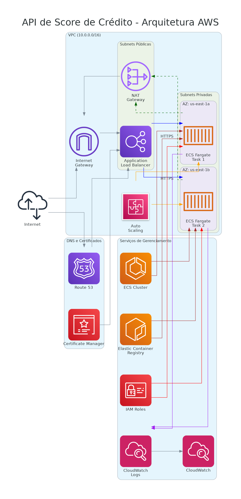

# Decisões Técnicas e Justificativas

## Desenho da Arquitetura
  

A arquitetura proposta para a API de Score de Crédito foi desenhada com foco em alta disponibilidade, escalabilidade e segurança. A seguir, apresento as principais decisões técnicas tomadas durante o desenvolvimento da solução, juntamente com suas justificativas.

Utilizado o [Diagrams as Code](https://diagrams.mingrammer.com/docs/getting-started/examples) para criar o diagrama da arquitetura, que pode ser editado e versionado no repositório.

## 1. Escolha da Linguagem: Go

**Decisão**: 

Optei por utilizar Go (Golang) no desenvolvimento da API, alinhando o desafio à minha jornada de aprendizado atual e ao objetivo de aprofundar meu domínio em tecnologias amplamente utilizadas no mercado, como Docker, Kubernetes e Terraform.  
A escolha do Go se deu por sua eficiência na construção de aplicações performáticas, com alta capacidade de lidar com grandes volumes de requisições e baixa latência — características essenciais para APIs modernas e escaláveis. Além disso, sua simplicidade, tipagem estática, suporte nativo à concorrência (via goroutines) e a geração de binários estáticos tornam o processo de desenvolvimento e deploy mais ágil e confiável, especialmente em ambientes containerizados.

**Justificativa**:

- **Alta Performance**: Go oferece desempenho próximo a linguagens compiladas como C/C++, mas com maior produtividade de desenvolvimento.
- **Baixo Consumo de Recursos**: Aplicações Go têm footprint de memória reduzido, permitindo maior densidade de containers.
- **Concorrência Nativa**: O modelo de goroutines e channels facilita o processamento paralelo eficiente.
- **Binários Estáticos**: Go gera binários independentes sem dependências externas, simplificando o deployment.
- **Tempo de Inicialização Rápido**: Crucial para ambientes serverless e escalabilidade dinâmica.

## 2. Escolha do Amazon ECS (Elastic Container Service)

**Decisão**: Implementei a API usando Amazon ECS com Fargate.

**Justificativa**:

- **Gerenciamento Simplificado**: ECS elimina a necessidade de gerenciar a infraestrutura subjacente, permitindo foco no desenvolvimento da aplicação.
- **Fargate (Serverless)**: Elimina a necessidade de provisionar e gerenciar servidores, com pagamento apenas pelos recursos consumidos.
- **Alta Disponibilidade**: Distribuição automática de containers entre múltiplas zonas de disponibilidade.
- **Integração com Serviços AWS**: Integração nativa com CloudWatch, IAM, ECR e outros serviços AWS.
- **Escalabilidade**: Suporte a auto-scaling baseado em métricas de CPU e memória.
- **Segurança**: Isolamento de tarefas e integração com VPC para controle de rede.
- **Custo-Benefício**: Mais econômico que Kubernetes para aplicações de menor complexidade.

## 3. Arquitetura Multi-AZ

**Decisão**: Implementei a infraestrutura em múltiplas Zonas de Disponibilidade (AZs).

**Justificativa**:

- **Resiliência**: Proteção contra falhas em uma única zona de disponibilidade.
- **Alta Disponibilidade**: Garantia de SLA elevado mesmo durante manutenções ou falhas da AWS.
- **Distribuição de Carga**: Balanceamento geográfico do tráfego para melhor desempenho.

## 4. VPC com Subnets Públicas e Privadas

**Decisão**: Criei uma VPC dedicada com subnets públicas e privadas.

**Justificativa**:

- **Isolamento de Rede**: Separação clara entre recursos expostos à internet e recursos internos.
- **Segurança em Camadas**: ALB em subnets públicas e containers em subnets privadas.
- **Controle de Tráfego**: NAT Gateway permite que containers em subnets privadas acessem a internet, mas não sejam acessíveis diretamente.

## 5. Application Load Balancer (ALB)

**Decisão**: Utilizei um ALB para gerenciar o tráfego para a aplicação.

**Justificativa**:

- **Balanceamento de Carga**: Distribuição eficiente do tráfego entre múltiplas instâncias da aplicação.
- **Health Checks**: Monitoramento contínuo da saúde dos containers e redirecionamento automático do tráfego.
- **SSL/TLS Termination**: Gerenciamento centralizado de certificados SSL/TLS.
- **Path-Based Routing**: Possibilidade de rotear tráfego com base em padrões de URL (útil para futuras expansões).
- **Integração com AWS WAF**: Possibilidade de adicionar proteção contra ataques web.

## 6. Auto Scaling

**Decisão**: Implementei políticas de auto scaling baseadas em CPU e memória.

**Justificativa**:

- **Elasticidade**: Ajuste automático da capacidade conforme a demanda.
- **Otimização de Custos**: Redução de recursos em períodos de baixa demanda.
- **Resiliência a Picos**: Capacidade de lidar com aumentos súbitos de tráfego.
- **Métricas Múltiplas**: Escalabilidade baseada tanto em CPU quanto em memória para cobrir diferentes padrões de carga.

## 7. Amazon ECR (Elastic Container Registry)

**Decisão**: Utilizei o ECR para armazenar e gerenciar imagens de containers.

**Justificativa**:

- **Integração com ECS**: Simplifica o fluxo de deployment de imagens para o ECS.
- **Segurança**: Controle de acesso via IAM e escaneamento automático de vulnerabilidades.
- **Alta Disponibilidade**: Serviço gerenciado com replicação automática.
- **Políticas de Ciclo de Vida**: Gerenciamento automático de versões de imagens para otimizar custos.

## 8. CloudWatch para Monitoramento e Logs

**Decisão**: Implementei monitoramento e logging centralizados com CloudWatch.

**Justificativa**:

- **Visibilidade Centralizada**: Coleta de logs e métricas em um único local.
- **Alertas**: Possibilidade de configurar alarmes baseados em métricas.
- **Retenção Configurável**: Definição de políticas de retenção de logs conforme necessidades de compliance.
- **Insights em Tempo Real**: Monitoramento em tempo real do desempenho da aplicação.

## 9. HTTPS com ACM (AWS Certificate Manager)

**Decisão**: Implementei HTTPS utilizando certificados gerenciados pelo ACM.

**Justificativa**:

- **Segurança**: Criptografia do tráfego entre clientes e a API.
- **Confiança**: Certificados confiáveis reconhecidos pelos navegadores.
- **Renovação Automática**: Gerenciamento automático do ciclo de vida dos certificados.
- **Integração com Route53**: Validação automática de domínio.

## 10. IAM Roles com Princípio de Privilégio Mínimo

**Decisão**: Criei roles IAM específicos para cada componente do sistema.

**Justificativa**:

- **Segurança**: Aplicação do princípio de privilégio mínimo.
- **Auditoria**: Facilidade para auditar permissões e identificar potenciais riscos.
- **Isolamento**: Separação clara de responsabilidades entre componentes.

## Benefícios da Arquitetura Proposta

- **Alta Disponibilidade**: Arquitetura multi-AZ com auto scaling garante disponibilidade mesmo durante falhas parciais.
- **Escalabilidade**: Capacidade de escalar horizontalmente para lidar com picos de demanda.
- **Segurança em Camadas**: Múltiplas camadas de segurança, desde a rede até o nível de aplicação.
- **Custo Otimizado**: Uso de serviços serverless e auto scaling para pagar apenas pelos recursos utilizados.
- **Operação Simplificada**: Uso de serviços gerenciados reduz a carga operacional.
- **Observabilidade**: Monitoramento e logging abrangentes para rápida detecção e resolução de problemas.
- **CI/CD Ready**: Arquitetura preparada para integração com pipelines de CI/CD.
- **Infraestrutura como Código**: Uso de Terraform para versionamento e automação da infraestrutura.
- **Facilidade de Manutenção**: Separação clara entre componentes facilita atualizações e manutenções.
- **Flexibilidade**: Possibilidade de adicionar novos serviços ou componentes sem grandes reestruturações.

## Conclusão

A arquitetura implementada para a API de Score de Crédito atende aos requisitos críticos de negócio, oferecendo uma solução resiliente, escalável e segura. O uso de serviços gerenciados da AWS, combinado com práticas modernas de infraestrutura como código (Terraform), proporciona uma base sólida para o crescimento futuro do serviço.